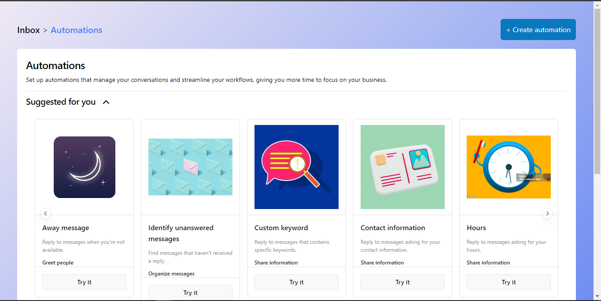
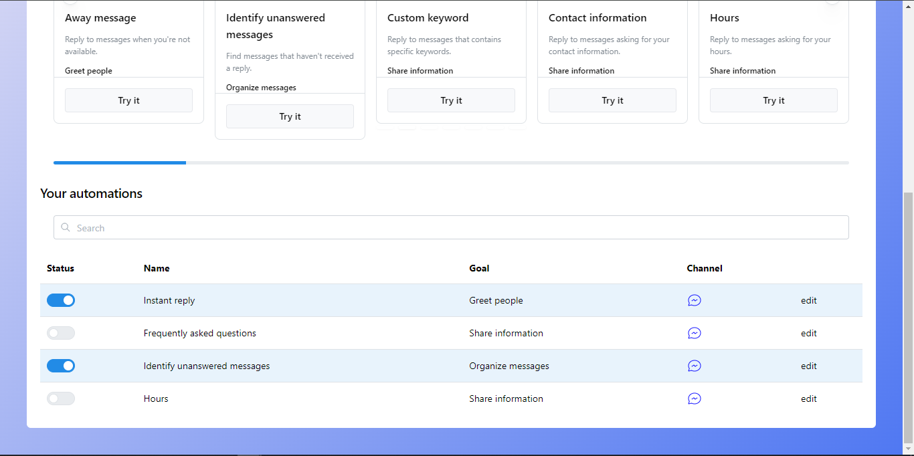

# chatlogic-clientside

<p align="center">
  Welcome to chatlogic-clientside, a simple replica of the Meta chat automation page. This project allows you to explore and understand the basic functionalities of Meta's chat automation features.
</p>

## Introduction

chatlogic-clientside is a straightforward implementation of a chat automation page inspired by Meta's chat features. This project provides a hands-on experience for those interested in building and understanding the fundamentals of chat automation.

## Features

- **Chat Interface:** Simple and intuitive chat interface.
- **Message Automation:** Explore basic chat automation features.
- **Replica of Meta Chat:** Mimics the look and feel of Meta's chat page.
- **Easy to Use:** Minimal setup and easy-to-understand code.

## Getting Started

To explore chatlogic-clientside, follow these steps:

1. **Clone the repository:**
    ```bash
    git clone https://github.com/soul-xettri/chatlogic-clientside.git
    cd Meta-Automation-Page
    ```

2. **Run the Application:**
    - Open the `index.html` file in a web browser.

3. **Explore the Chat Interface:**
    - Experience the simple chat interface and basic automation features.
    - Send and receive messages to understand the chat functionalities.

## Replica of Meta Chat

chatlogic-clientside replicates the look and feel of Meta's chat interface. While it's a simplified version, it provides insights into building chat features and automation.

## Screenshots

For a visual overview of chatlogic-clientside, refer to the screenshots provided below:





## Contributing

Contributions are welcome! If you have suggestions for improvement, find bugs, or want to contribute new features, please submit a pull request or open an issue.

## License

This project is licensed under the MIT License.

Feel free to explore and experiment with chatlogic-clientside! 🤖✨
